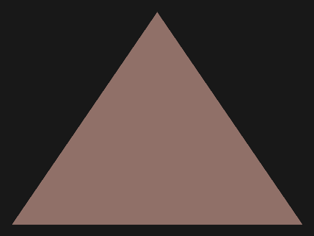

# Lesson I.2: Winding Number Triangle

> **Result:** `pictures/ex02_winding_number_triangle.ppm`
>
> In this lesson we will draw a filled triangle. To determine whether a pixel
> lies inside the triangle, we'll use a technique called the **winding number**.
> This is a classic algorithm from computational geometry that generalizes to
> arbitrary polygons — not just triangles.



---

## What We Are Doing

In the previous lesson we drew circles and rectangles. A circle has a simple
inside-test: `dx² + dy² ≤ r²`. A rectangle is even simpler: a range of x and y.

But what about a triangle? There's no single simple formula like the circle
equation. Instead, we'll use a different approach: the **winding number**.

The idea is this: imagine you're standing at a point `(x, y)` on the screen.
You shoot a ray to the left (toward `x = -∞`) and count how many triangle
edges it crosses. If the count is **odd**, the point is **inside** the triangle.
If the count is **even**, the point is **outside**.

This is the same principle as the classic "even-odd rule" used in 2D graphics
and vector fill algorithms. It works for any polygon, not just triangles.

---

## Geometry Structures

The module `src/geometry/mod.rs` defines the basic geometric primitives we'll
use from now on.

### `Point`

```rust
#[derive(Copy, Clone)]
pub struct Point {
    pub x: i16,
    pub y: i16
}
```

A 2D point with signed integer coordinates. We use `i16` (signed) so points
can be placed outside the visible area, just like the circle center in the
previous lesson.

### `Line`

```rust
#[derive(Copy, Clone)]
pub struct Line {
    pub start: Point,
    pub end: Point
}
```

A line segment defined by two endpoints.

### `Triangle`

```rust
#[derive(Copy, Clone)]
pub struct Triangle {
    pub a: Point,
    pub b: Point,
    pub c: Point,
}
```

A triangle defined by three vertices: `a`, `b`, and `c`. The order of the
vertices matters — it defines the **winding direction** (clockwise or
counter-clockwise), which we'll discuss later.

The `lines` method returns the three edges of the triangle:

```rust
pub fn lines(self) -> [Line; 3] {
    [
        Line::new(self.a, self.b),
        Line::new(self.b, self.c),
        Line::new(self.c, self.a)
    ]
}
```

Each edge connects two consecutive vertices, and the last edge connects the
third vertex back to the first — closing the triangle.

---

## The Winding Number Algorithm

The core of this lesson is the `winding_n` method, implemented in
`src/geometry/ex02_winding_number_triangle.rs`.

```rust
impl Triangle {
    pub fn winding_n(self, x_range: RangeInclusive<i16>, y: i16) -> i32 {
        // ...
    }
}
```

This method counts how many triangle edges are crossed by a **horizontal ray**
at height `y`, spanning from `x_range.start()` to `x_range.end()`.

### How it works

For each of the three edges of the triangle, the algorithm:

1. **Skips edges that don't span the ray's height.** If the edge is entirely
   above or entirely below `y`, it can't be crossed.

2. **Handles horizontal edges specially.** If the edge is horizontal (both
   endpoints have the same `y`), it checks whether the edge lies within the
   ray's x-range and counts it if so.

3. **Computes the intersection x-coordinate.** For non-horizontal edges that
   span `y`, it linearly interpolates to find where the edge crosses the
   horizontal line at height `y`:

   ```
   t = (y - min_y) / (max_y - min_y)
   x = min_x + t * (max_x - min_x)
   ```

   If this intersection x lies within `x_range`, the edge is counted.

Let's look at the full implementation:

```rust
pub fn winding_n(self, x_range: RangeInclusive<i16>, y: i16) -> i32 {
    let max_y = self.a.y.max(self.b.y).max(self.c.y);
    let y = if y == max_y { y as f32 - 0.005 } else { y as f32 + 0.005 };

    let (x0, x1) = (*x_range.start() as f32, *x_range.end() as f32);

    let mut winding_number = 0;
    for [a, b] in self.lines().map(|it| [
        vec2(it.start.x as f32, it.start.y as f32),
        vec2(it.end.x as f32, it.end.y as f32)
    ]) {
        let (min_x, min_y, max_x, max_y) = if a.y < b.y {
            (a.x, a.y, b.x, b.y)
        } else {
            (b.x, b.y, a.x, a.y)
        };

        if !(min_y..=max_y).contains(&y) {
            continue;
        }

        let dy = max_y - min_y;
        if dy < f32::EPSILON {
            if (x0..=x1).contains(&a.x) || (x0..=x1).contains(&b.x) {
                winding_number += 1;
            }
            continue;
        }

        let t = (y - min_y) / dy;
        let x = min_x + t * (max_x - min_x);

        if (x0..=x1).contains(&x) {
            winding_number += 1;
        }
    }
    winding_number
}
```

### The edge-case hack

```rust
let max_y = self.a.y.max(self.b.y).max(self.c.y);
let y = if y == max_y { y as f32 - 0.005 } else { y as f32 + 0.005 };
```

When the ray passes exactly through a vertex of the triangle, the winding
number can be computed incorrectly — an edge might be double-counted or
missed entirely. To avoid this, the ray's `y` is nudged by a tiny offset
(`0.005` pixels). If `y` coincides with the bottommost vertex, the ray is
shifted slightly upward; otherwise it's shifted slightly downward. This
ensures the ray never passes exactly through a vertex.

> **Why 0.005?** The value is arbitrary — any small offset that avoids
> landing exactly on a vertex works. The key idea is to perturb the ray
> just enough to miss all vertices while staying within the same pixel row.

### Putting it together: inside or outside?

After computing the winding number, the rule is simple:

- **Odd** winding number → the point is **inside** the triangle.
- **Even** (including zero) winding number → the point is **outside**.

This is the **even-odd rule**. You can think of it as crossing a fence:
each time you cross an edge, you switch between inside and outside. Start
outside (count = 0), cross once → inside (count = 1), cross again → outside
(count = 2), and so on.

---

## The Drawing Command Pattern

Before looking at `draw_triangle`, let's look at a new design pattern
introduced in this lesson — the **pixel drawing command**.

```rust
pub trait PixelDrawingCommand {
    fn draw_pixel(&self, software_buffer: &mut SoftwareBuffer, x: u16, y: u16);
}

pub struct FillPixelCommand(pub Color24);

impl PixelDrawingCommand for FillPixelCommand {
    fn draw_pixel(&self, software_buffer: &mut SoftwareBuffer, x: u16, y: u16) {
        software_buffer.set_pixel(x, y, self.0)
    }
}
```

Instead of hardcoding that `draw_triangle` fills pixels with a solid color,
the method accepts any type that implements `PixelDrawingCommand`. This
separates **which pixels to draw** (the triangle geometry) from **how to
draw each pixel** (the command).

`FillPixelCommand` is the simplest command — it just sets each pixel to a
given color. But in future lessons we'll create more sophisticated commands
that interpolate colors, sample textures, or apply lighting.

> This pattern is a simplified version of the **shader** concept used in
> real graphics APIs. A shader is a small program that runs per-pixel (or
> per-vertex) and decides what color to output. Our `PixelDrawingCommand`
> trait plays the same role.

---

## Drawing the Triangle

The `draw_triangle` method lives in `src/software_buffer/ex02_winding_number_triangle.rs`:

```rust
impl SoftwareBuffer {
    pub fn draw_triangle(
        &mut self,
        triangle: Triangle,
        command: &impl PixelDrawingCommand
    ) {
        let min_x = triangle.a.x.min(triangle.b.x).min(triangle.c.x).max(0);
        let max_x = triangle.a.x.max(triangle.b.x).max(triangle.c.x);
        let min_y = triangle.a.y.min(triangle.b.y).min(triangle.c.y).max(0);
        let max_y = triangle.a.y.max(triangle.b.y).max(triangle.c.y);

        for y in min_y..=max_y {
            for x in (min_x..=max_x).filter(|&x| triangle.winding_n(min_x..=x, y) % 2 != 0) {
                command.draw_pixel(self, x as _, y as _);
            }
        }
    }
}
```

### Bounding box

First, we compute the bounding box of the triangle — the smallest rectangle
that contains all three vertices:

```rust
let min_x = triangle.a.x.min(triangle.b.x).min(triangle.c.x).max(0);
let max_x = triangle.a.x.max(triangle.b.x).max(triangle.c.x);
let min_y = triangle.a.y.min(triangle.b.y).min(triangle.c.y).max(0);
let max_y = triangle.a.y.max(triangle.b.y).max(triangle.c.y);
```

The `.max(0)` on `min_x` and `min_y` clamps the bounding box to the visible
area, so we don't iterate over pixels that don't exist. Note that `max_x`
and `max_y` are not clamped to the buffer dimensions — that's fine because
`set_pixel` safely ignores out-of-bounds coordinates (in the case the reader 
has completed excercises, of couse). The real reason for clamping with zero 
is the need to cast to the `u16` type, since `set_pixel` method only accepts 
`u16` coordinates.

### Per-pixel winding test

```rust
for y in min_y..=max_y {
    for x in (min_x..=max_x).filter(|&x| triangle.winding_n(min_x..=x, y) % 2 != 0) {
        command.draw_pixel(self, x as _, y as _);
    }
}
```

For each row `y` in the bounding box, we iterate over every `x` from `min_x`
to `max_x`. But we **filter** — only keeping x-values where the winding
number is odd (`% 2 != 0`).

The key detail: `winding_n(min_x..=x, y)` counts how many edges are crossed
by a ray from `min_x` to `x` at height `y`. If this count is odd, the point
`(x, y)` is inside the triangle, and we draw it.

> **Why a ray from `min_x` to `x`?** We're shooting a ray from the left edge
> of the bounding box to the current pixel. This is equivalent to shooting
> a ray from `-∞` to `x`, because no triangle edges exist to the left of
> `min_x` (by definition of the bounding box). Using `min_x` as the start
> is an optimization — we skip testing edges that can't possibly be crossed.

---

## Example Walkthrough

Now let's look at the full example — `examples/ex02_winding_number_triangle.rs`:

```rust
use mev_graphics_tutorial::{
    software_buffer::{
        SoftwareBuffer,
        Color24,
        ex02_winding_number_triangle::FillPixelCommand
    },
    geometry::{Point, Triangle},
};

pub fn main() {
    let mut buffer = SoftwareBuffer::new(640, 480);
    buffer.clear(Color24 { r: 0x18, g: 0x18, b: 0x18 });
    buffer.draw_triangle(
        Triangle::new(
            Point { x: 24, y: 456 },
            Point { x: 616, y: 456 },
            Point { x: 320, y: 24 },
        ),
        &FillPixelCommand(Color24 { r: 0x90, g: 0x70, b: 0x68 })
    );
    buffer.print_as_ppm();
}
```

### Step 1: Create the Buffer

```rust
let mut buffer = SoftwareBuffer::new(640, 480);
buffer.clear(Color24 { r: 0x18, g: 0x18, b: 0x18 });
```

Create a 640×480 buffer and fill it with a dark gray background
(`0x18` = 24 in decimal — a very dark gray).

### Step 2: Define the Triangle

```rust
Triangle::new(
    Point { x: 24, y: 456 },
    Point { x: 616, y: 456 },
    Point { x: 320, y: 24 },
)
```

The triangle has:
- Vertex `a` at `(24, 456)` — bottom-left
- Vertex `b` at `(616, 456)` — bottom-right
- Vertex `c` at `(320, 24)` — top-center

This forms a large triangle pointing upward, nearly filling the image.

### Step 3: Draw

```rust
buffer.draw_triangle(
    triangle,
    &FillPixelCommand(Color24 { r: 0x90, g: 0x70, b: 0x68 })
);
```

We draw the triangle using a `FillPixelCommand` with a brownish color
(`0x90` = 144 red, `0x70` = 112 green, `0x68` = 104 blue — a muted
brown-gray).

### Step 4: Output

```rust
buffer.print_as_ppm();
```

Output the result in PPM format.

---

## How to Run the Example

```sh
cargo run --example ex02_winding_number_triangle > pictures/ex02_winding_number_triangle.ppm
```

Or build and run separately:

```sh
cargo build --release --example ex02_winding_number_triangle
./target/release/examples/ex02_winding_number_triangle > pictures/ex02_winding_number_triangle.ppm
```

Open `pictures/ex02_winding_number_triangle.ppm` in any image viewer. You
should see a filled brownish triangle on a dark gray background.

---

## Summary

In this lesson we learned about:

- **Geometry primitives** — `Point`, `Line`, and `Triangle` as the building
  blocks for shape rendering.
- **The winding number** — counting how many triangle edges a horizontal ray
  crosses to determine if a point is inside or outside.
- **The even-odd rule** — an odd winding number means inside, even means outside.
- **Edge-case handling** — nudging the ray's y-coordinate to avoid incorrect
  counts when the ray passes exactly through a vertex.
- **The pixel drawing command pattern** — separating geometry (which pixels)
  from shading (what color), a simplified precursor to shaders.
- **`draw_triangle`** — iterating over the bounding box and using the winding
  number to filter which pixels to draw.

In the next lesson we'll use the winding number trick to draw more complex
vector shapes by combining multiple triangles.

---

## Exercises

### Exercise 1: Flip the triangle

Change the vertex order so the triangle is defined clockwise instead of
counter-clockwise (e.g., swap vertices `a` and `b`). Does the result change?
Why or why not? The winding number algorithm uses the even-odd rule, which
is independent of a winding direction — but can you think of a scenario where
winding direction would matter?

### Exercise 2: Draw two overlapping triangles

Draw two triangles that overlap partially. Use different colors for each.
Observe how the second triangle overwrites the first in the overlapping
region. What happens if you make the second triangle's color semi-transparent?
(You'll need to modify `FillPixelCommand` to blend colors — try averaging
the new color with the existing pixel color.)

### Exercise 3: Understand the ray direction

The current implementation shoots a ray to the **left** (from `min_x` to `x`).
Could you shoot the ray to the **right** instead (from `x` to `max_x`)? Would
the inside/outside test still work? Try modifying `draw_triangle` to use
`triangle.winding_n(x..=max_x, y)` and verify that the result is the same.

### Exercise 4: Performance of the winding number approach

For each pixel in the bounding box, `winding_n` iterates over all three edges
of the triangle. For a triangle with a bounding box of `W × H` pixels, how
many edge tests are performed in total? How does this compare to the circle
algorithm from the previous lesson? Can you think of a way to reduce the
number of tests?

### Exercise 5: General polygon rendering and the star

The `winding_n` method works for any polygon, not just triangles. The only
triangle-specific part is the `lines()` call, which returns exactly three
edges. For a general polygon, you'd need to provide an arbitrary list of
edges.

**Task A:** Write a generic `draw_polygon` method on `SoftwareBuffer` that
accepts a slice of `Line` segments and a `PixelDrawingCommand`:

```rust
pub fn draw_polygon(
    &mut self,
    lines: &[Line],
    command: &impl PixelDrawingCommand
)
```

The method should compute the bounding box from all line endpoints, then
use the same winding number logic as `draw_triangle`, but iterate over all
the provided edges instead of the three fixed edges of a triangle.

**Task B:** Define a `Polygon` struct that stores a list of `Point` vertices
and has a `lines()` method (like `Triangle` does). Then use it to draw a
five-pointed star. The vertices of a regular five-pointed star can be
computed by alternating between two radii:

```
for i in 0..10 {
    angle = i * π / 5  (or i * 36°)
    radius = if i % 2 == 0 { outer_radius } else { inner_radius }
    x = center_x + radius * cos(angle)
    y = center_y + radius * sin(angle)
}
```

Place the star at the center of the image with a comfortable size.

**Question:** After drawing the star, you'll notice that the **center**
(inner pentagon) is **not filled** — it shows the background color instead.
Why does this happen?