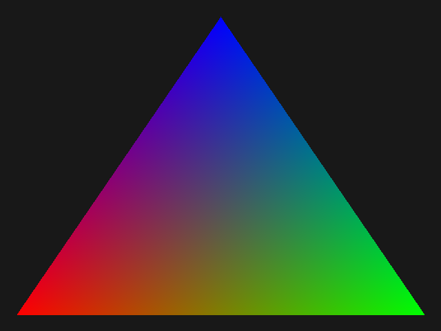

# Lesson I.4: Barycentric Coordinates

> **Result:** `pictures/ex04_barycentric_coordinates.ppm`
>
> In this lesson we will learn about **barycentric coordinates** — a way to
> describe any point inside a triangle as a weighted combination of the three
> vertices. We'll use this to smoothly interpolate colors across the surface
> of a triangle, producing a classic RGB gradient triangle.



---

## What We Are Doing

In the previous lessons we drew triangles with a single solid color. But in
real graphics, triangles rarely have a flat color. Instead, each vertex has
its own color (or other attributes), and the colors blend smoothly across the
triangle's surface.

To achieve this, we need a way to answer the question: *"Given a point P
inside triangle ABC, how much of each vertex's color should contribute to
P's color?"*

The answer is **barycentric coordinates**. They tell us, for any point inside
a triangle, the weight (or influence) of each vertex. The three weights always
sum to 1, and each weight is between 0 and 1 for points inside the triangle.

---

## The Intuition

Imagine a triangle with vertices A, B, and C. Each vertex has a color:
A is red, B is green, C is blue.

- At vertex A, the color should be pure red — A's weight is 1, B and C are 0.
- At vertex B, the color should be pure green — B's weight is 1, A and C are 0.
- At the center of the triangle, all three vertices contribute equally —
  each weight is approximately 0.33.
- Along the edge from A to B, C's weight is 0, and A and B blend linearly.

The barycentric coordinates `(α, β, γ)` give us these three weights:

```
P = α·A + β·B + γ·C
α + β + γ = 1
```

If all three are non-negative, the point is inside the triangle. If any is
negative, the point is outside.

---

## Computing Barycentric Coordinates

The implementation lives in `src/geometry/ex04_barycentric_coordinates.rs`.

### The `calculate_barycentric` function

```rust
fn calculate_barycentric(pt: Vec2, [pt0, pt1, pt2]: [Vec2; 3]) -> [f32; 3] {
    fn area(lhs: Vec2, rhs: Vec2) -> f32 {
        let lhs = glam::vec3(lhs.x, lhs.y, 0.0);
        let rhs = glam::vec3(rhs.x, rhs.y, 0.0);
        lhs.cross(rhs).z
    }

    let e0 = pt1 - pt0;
    let e1 = pt2 - pt1;

    let v0 = pt - pt0;
    let v1 = pt - pt1;
    let v2 = pt - pt2;

    let a = area(e0, e1);
    [
        area(v1, v2) / a,
        area(v2, v0) / a,
        area(v0, v1) / a
    ]
}
```

The key insight is that barycentric coordinates can be computed using
**signed areas** (cross products) of sub-triangles.

### The area function

```rust
fn area(lhs: Vec2, rhs: Vec2) -> f32 {
    let lhs = glam::vec3(lhs.x, lhs.y, 0.0);
    let rhs = glam::vec3(rhs.x, rhs.y, 0.0);
    lhs.cross(rhs).z
}
```

This computes the **signed area** of the parallelogram formed by two 2D
vectors. The cross product of two 3D vectors gives a perpendicular vector;
since our vectors lie in the XY plane, only the Z component is non-zero.
This Z component equals `lhs.x * rhs.y - lhs.y * rhs.x`, which is twice the
signed area of the triangle formed by the two vectors.

The sign matters: it tells us the orientation (clockwise vs counter-clockwise).

### The three weights

Given a point `pt` and triangle vertices `pt0`, `pt1`, `pt2`:

```rust
let a = area(e0, e1);  // total triangle area (×2)
[
    area(v1, v2) / a,  // weight for pt0 (vertex A)
    area(v2, v0) / a,  // weight for pt1 (vertex B)
    area(v0, v1) / a,  // weight for pt2 (vertex C)
]
```

Each weight is the ratio of a sub-triangle's area to the total triangle's
area:

- **Weight α** (for vertex A) = area of triangle (pt, pt1, pt2) / area of (pt0, pt1, pt2)
- **Weight β** (for vertex B) = area of triangle (pt, pt2, pt0) / area of (pt0, pt1, pt2)
- **Weight γ** (for vertex C) = area of triangle (pt, pt0, pt1) / area of (pt0, pt1, pt2)

When `pt` is at vertex A, the sub-triangle (pt, pt1, pt2) is the full
triangle, so α = 1 and the others are 0. When `pt` is at the center, all
three sub-triangles have equal area, so α = β = γ ≈ 0.33.

> **Why signed area?** If the point is outside the triangle, one or more
> sub-triangles will have a negative signed area (because the orientation
> flips). This makes the corresponding weight negative, which tells us the
> point is outside. We don't use this property directly in this lesson (the
> winding number already filters outside pixels), but it's useful in other
> algorithms.

### The `Point` method

```rust
impl Point {
    pub fn calculate_barycentric_in(self, positions: [Self; 3]) -> [f32; 3] {
        let pt = vec2(self.x as f32, self.y as f32);
        let positions = positions.map(|it| vec2(it.x as f32, it.y as f32));
        calculate_barycentric(pt, positions)
    }
}
```

A convenience method that converts `Point` (integer) to `Vec2` (float) and
calls `calculate_barycentric`.

---

## Mixing Values by Barycentric Coordinates

Once we have the barycentric coordinates, we can interpolate any value across
the triangle. The module provides generic mixing functions:

### `mix_1_component_by_barycentric`

```rust
pub fn mix_1_component_by_barycentric(values: [f32; 3], barycentric: [f32; 3]) -> f32 {
    barycentric.iter().copied()
        .zip(values.iter().copied())
        .fold(0.0, |acc, (mul, x)| acc + x * mul)
}
```

Interpolates a single scalar value (e.g., a grayscale intensity). Given
values at the three vertices and the barycentric weights, it computes:

```
result = α·value0 + β·value1 + γ·value2
```

### `mix_3_components_by_barycentric`

```rust
pub fn mix_3_components_by_barycentric(
    values: [(f32, f32, f32); 3],
    barycentric: [f32; 3]
) -> (f32, f32, f32)
```

Interpolates a 3-component value (e.g., RGB color). Each component is
interpolated independently using the same barycentric weights. This is
exactly what we need for color blending.

The module also provides `mix_2_components_by_barycentric` and
`mix_4_components_by_barycentric` for 2D coordinates (like UV) and 4D
values (like RGBA colors), following the same pattern.

---

## The Drawing Command

The `DrawBarycentricTriangleCommand` in
`src/software_buffer/ex04_barycentric_coordinates.rs` ties everything together:

```rust
pub struct DrawBarycentricTriangleCommand(pub [Point; 3]);

impl PixelDrawingCommand for DrawBarycentricTriangleCommand {
    fn draw_pixel(&self, software_buffer: &mut SoftwareBuffer, x: u16, y: u16) {
        let point = Point { x: x as _, y: y as _ };
        let barycentric_coords = point.calculate_barycentric_in(self.0);
        let colors = [
            Color24 { r: 255, g: 0, b: 0 },  // vertex A: red
            Color24 { r: 0, g: 255, b: 0 },  // vertex B: green
            Color24 { r: 0, g: 0, b: 255 },  // vertex C: blue
        ];
        let colors = colors.map(|color| (color.r as f32, color.g as f32, color.b as f32));
        let (r, g, b) = mix_3_components_by_barycentric(colors, barycentric_coords);
        let color = Color24 {
            r: r.round().clamp(0.0, 255.0) as u8,
            g: g.round().clamp(0.0, 255.0) as u8,
            b: b.round().clamp(0.0, 255.0) as u8
        };
        software_buffer.set_pixel(x, y, color);
    }
}
```

For each pixel inside the triangle:

1. **Compute barycentric coordinates** — how much each vertex contributes to
   this pixel.
2. **Define vertex colors** — A is red, B is green, C is blue.
3. **Mix the colors** — using `mix_3_components_by_barycentric`, each channel
   is interpolated independently.
4. **Set the pixel** — convert the interpolated float values back to `u8`
   and write to the buffer.

The result is a smooth gradient: pure red at vertex A, pure green at vertex B,
pure blue at vertex C, and blended colors everywhere in between.

---

## Example Walkthrough

Now let's look at the full example — `examples/ex04_barycentric_coordinates.rs`:

```rust
use mev_graphics_tutorial::{
    software_buffer::{
        SoftwareBuffer,
        Color24,
        ex04_barycentric_coordinates::DrawBarycentricTriangleCommand
    },
    geometry::{Point, Triangle},
};

pub fn main() {
    let mut buffer = SoftwareBuffer::new(640, 480);
    buffer.clear(Color24 { r: 0x18, g: 0x18, b: 0x18 });
    let triangle = Triangle::new(
        Point { x: 24, y: 456 },
        Point { x: 616, y: 456 },
        Point { x: 320, y: 24 },
    );
    buffer.draw_triangle(
        triangle,
        &DrawBarycentricTriangleCommand([
            triangle.a,
            triangle.b,
            triangle.c
        ])
    );
    buffer.print_as_ppm();
}
```

### Step 1: Create the Buffer

```rust
let mut buffer = SoftwareBuffer::new(640, 480);
buffer.clear(Color24 { r: 0x18, g: 0x18, b: 0x18 });
```

Create a 640×480 buffer with a dark gray background.

### Step 2: Define the Triangle

```rust
let triangle = Triangle::new(
    Point { x: 24, y: 456 },
    Point { x: 616, y: 456 },
    Point { x: 320, y: 24 },
);
```

Same large upward-pointing triangle as in lesson 2: bottom-left, bottom-right,
top-center.

### Step 3: Draw with Barycentric Colors

```rust
buffer.draw_triangle(
    triangle,
    &DrawBarycentricTriangleCommand([
        triangle.a,
        triangle.b,
        triangle.c
    ])
);
```

We pass the triangle's vertices to `DrawBarycentricTriangleCommand`. The
command uses these vertices to compute barycentric coordinates for each pixel
and assigns red to vertex A, green to vertex B, and blue to vertex C.

### Step 4: Output

```rust
buffer.print_as_ppm();
```

---

## How to Run the Example

```sh
cargo run --example ex04_barycentric_coordinates > pictures/ex04_barycentric_coordinates.ppm
```

Or build and run separately:

```sh
cargo build --release --example ex04_barycentric_coordinates
./target/release/examples/ex04_barycentric_coordinates > pictures/ex04_barycentric_coordinates.ppm
```

Open `pictures/ex04_barycentric_coordinates.ppm` in any image viewer. You
should see a triangle with a smooth RGB gradient: red in the bottom-left
corner, green in the bottom-right, and blue at the top.

---

## Why Barycentric Coordinates Matter

Barycentric coordinates are one of the most important concepts in computer
graphics. They are used for:

- **Color interpolation** — blending vertex colors across a triangle (this lesson).
- **Texture mapping** — interpolating UV coordinates to find which texel to
  sample (next lessons).
- **Depth interpolation** — computing the Z value at each pixel for
  depth testing.
- **Normal interpolation** — smoothly varying surface normals for lighting
  (Gouraud and Phong shading).
- **Any per-vertex attribute** — any value stored at vertices can be
  interpolated across the triangle using barycentric coordinates.

The GPU performs this interpolation automatically in hardware after the
vertex shader runs. Understanding how it works is essential for writing
effective shaders.

---

## Summary

In this lesson we learned about:

- **Barycentric coordinates** — three weights `(α, β, γ)` that describe a
  point inside a triangle as a combination of its vertices, with `α + β + γ = 1`.
- **Signed area computation** — using the 2D cross product to compute
  sub-triangle areas, from which barycentric weights are derived.
- **Inside/outside test** — if all three weights are non-negative, the point
  is inside the triangle; if any is negative, it's outside.
- **Value interpolation** — mixing per-vertex values (colors, coordinates,
  normals) using barycentric weights.
- **`DrawBarycentricTriangleCommand`** — a pixel command that computes
  barycentric coordinates per pixel and interpolates RGB colors.

In the next lesson we'll use barycentric coordinates to interpolate UV
coordinates, which will allow us to map textures onto triangles.

---

## Exercises

### Exercise 1: Custom vertex colors

Modify `DrawBarycentricTriangleCommand` to use custom colors for each vertex
instead of the hardcoded red/green/blue. Try yellow, cyan, and magenta. How
does the gradient change?

### Exercise 2: Verify the weights

Pick a point at the exact center of the triangle (the centroid). Compute its
barycentric coordinates by hand (or add a `println!` in the command). Are all
three weights equal to `1/3`? Why?

### Exercise 3: Interpolate a single channel

Use `mix_1_component_by_barycentric` to interpolate a single grayscale
intensity across the triangle. Assign values `0.0`, `0.5`, and `1.0` to the
three vertices. What does the gradient look like?

### Exercise 4: Degenerate triangle

What happens if all three vertices are collinear (lie on the same line)?
What is the value of `a` (the total area) in `calculate_barycentric`? Why
would this be a problem, and how might you guard against it?