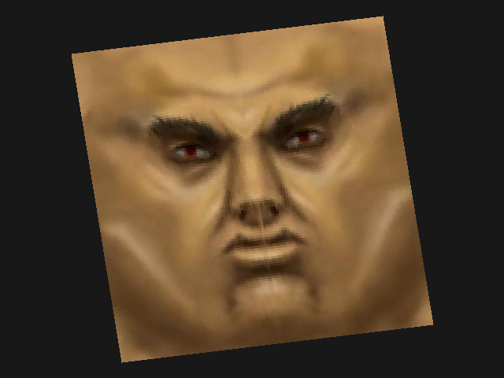

# Lesson I.6: Texture Mapping — Nearest Neighbor

> **Result:** `pictures/ex06_texture_mapping_nearest.ppm`
>
> In this lesson we will finally apply a **real texture** — an image loaded
> from a PNG file — onto our quad. We'll use the **nearest neighbor**
> sampling method: for each pixel, we convert its interpolated UV coordinates
> into integer texel indices and pick the closest texel. The result will have
> a blocky, pixel-art look that reveals the discrete nature of the texture.



---

## What We Are Doing

In the previous lesson we interpolated UV coordinates across a quad and
visualized them as colors (red = U, green = V). Now we replace that
visualization with actual **texture sampling**: we load an image from disk,
store it as an array of `Color24` values, and for each pixel on screen look
up the corresponding **texel** (texture pixel) using the interpolated UV
coordinates.

This is the fundamental operation that 3D graphics APIs do billions of times
per second: **texture mapping** — wrapping a 2D image onto a 3D surface.

---

## Loading a Texture

The example uses the `image` crate to load a PNG file embedded in the binary:

```rust
const SWIBORG_TEXTURE_BYTES: &[u8] = include_bytes!("../assets/swiborg.png");
```

`include_bytes!` is a Rust macro that embeds the file's contents directly
into the compiled binary at compile time. This is a common trick for game
assets — no file loading needed at runtime.

```rust
let image = image::load_from_memory(SWIBORG_TEXTURE_BYTES)
    .expect("Failed to load image");
let image = image.to_rgb8();
let texture_width = image.width() as u16;
let texture_height = image.height() as u16;
```

We use the `image` crate to decode the PNG from memory into an RGB8 image
(each pixel is 3 bytes: R, G, B). Then we copy it into our own texture
buffer:

```rust
let mut texture = vec![Color24 { r: 0, g: 0, b: 0 }; texture_width as usize * texture_height as usize];
for (i, pixel) in image.pixels().enumerate() {
    texture[i] = Color24 {
        r: pixel[0],
        g: pixel[1],
        b: pixel[2]
    }
}
```

This converts the `image` crate's pixel format into `Color24`, which is
what our `SoftwareBuffer` and drawing commands understand. The texture is
stored as a flat array — exactly the same layout as `SoftwareBuffer.pixels`.

---

## The Nearest Neighbor Sampling Command

The `DrawTextureMappedTriangleNearestCommand` in
`src/software_buffer/ex06_texture_mapping_nearest.rs` extends the UV
command from the previous lesson with actual texture lookups:

```rust
pub struct DrawTextureMappedTriangleNearestCommand<'a> {
    pub positions: &'a [Point],
    pub uv_coords: &'a [(f32, f32)],
    pub indices: [u16; 3],
    pub texture: &'a [Color24],
    pub texture_width: u16,
    pub texture_height: u16,
}

impl<'a> PixelDrawingCommand for DrawTextureMappedTriangleNearestCommand<'a> {
    fn draw_pixel(&self, software_buffer: &mut SoftwareBuffer, x: u16, y: u16) {
        let indices = self.indices.map(|it| it as usize);

        assert_eq!(self.positions.len(), self.uv_coords.len());
        assert!(indices[0] < self.positions.len());
        assert!(indices[1] < self.positions.len());
        assert!(indices[2] < self.positions.len());

        let positions = indices.map(|id| self.positions[id]);
        let uv_coords = indices.map(|id| self.uv_coords[id]);

        let point = Point { x: x as _, y: y as _ };
        let barycentric_coords = point.calculate_barycentric_in(positions);
        let (u, v) = mix_2_components_by_barycentric(uv_coords, barycentric_coords);

        // Invert v to get the correct orientation of the texture
        let v = 1.0 - v;

        let texture_x = u * (self.texture_width - 1) as f32;
        let texture_x = (texture_x.round() as u16).clamp(0, self.texture_width - 1);

        let texture_y = v * (self.texture_height - 1) as f32;
        let texture_y = (texture_y.round() as u16).clamp(0, self.texture_height - 1);

        let color = self.texture[texture_y as usize * self.texture_width as usize + texture_x as usize];

        software_buffer.set_pixel(x, y, color);
    }
}
```

Let's break it down.

### The new fields

- `texture` — a flat slice of `Color24` values representing the entire image.
- `texture_width` and `texture_height` — the dimensions of the texture in texels.

### V inversion

```rust
let v = 1.0 - v;
```

Why do we flip `v`? The texture coordinate system has `v = 0` at the **top**
and `v = 1` at the **bottom** (the image file stores pixel rows from top to
bottom). But in our screen coordinates, `y = 0` is also at the top and
`y = height` is at the bottom. Without the inversion, the texture would appear
upside-down.

However, our UV coordinates were assigned such that `v = 0` is at the
bottom-left vertex and `v = 1` is at the top-left vertex **in screen space**.
Since the screen's Y axis points downward but the texture's V axis points
upward, we must invert: `v_sampled = 1.0 - v_screen`. This makes the texture's
top correspond to the screen's top.

> **Why is this a constant problem in graphics?** Different systems use
> different conventions for the origin of image coordinates. Image files
> typically have the origin at the top-left (Y down), while 3D graphics
> often use bottom-left (Y up) for texture coordinates. The fix is usually
> a simple `v = 1.0 - v` at some stage of the pipeline.

### Nearest neighbor sampling

```rust
let texture_x = u * (self.texture_width - 1) as f32;
let texture_x = (texture_x.round() as u16).clamp(0, self.texture_width - 1);

let texture_y = v * (self.texture_height - 1) as f32;
let texture_y = (texture_y.round() as u16).clamp(0, self.texture_height - 1);
```

The UV coordinates are in the range `[0, 1]`. To convert them to texel
indices we:

1. **Scale** by `(texture_width - 1)` or `(texture_height - 1)` — the
   maximum valid index. For a 256×256 texture, `u = 0.0` maps to texel
   column 0, `u = 1.0` maps to texel column 255.
2. **Round** to the nearest integer — this is the **nearest neighbor**
   part. Instead of blending between adjacent texels, we pick the closest
   one.
3. **Clamp** to valid bounds — in case of floating-point rounding issues
   or UV values outside `[0, 1]`.

This is the simplest texture sampling algorithm. It's fast and produces a
sharp, blocky result that emphasizes the texel grid.

### The texel lookup

```rust
let color = self.texture[texture_y as usize * self.texture_width as usize + texture_x as usize];
```

We convert the 2D texel coordinates `(texture_x, texture_y)` into a 1D
index using the same formula as `SoftwareBuffer.get_pixel`: `index = y * width + x`.

---

## The UV Range

Notice that in this example the UV coordinates are not `(0, 0)` to `(1, 1)` —
they are cropped:

```rust
const UV_COORDS: &[(f32, f32)] = &[
    (0.25, 0.25),  // vertex 0: bottom-left
    (0.25, 0.75),  // vertex 1: top-left
    (0.75, 0.75),  // vertex 2: top-right
    (0.75, 0.25),  // vertex 3: bottom-right
];
```

This means only the **center portion** of the texture (25% to 75% in both
U and V) is mapped onto the quad. The rest of the texture is not visible.
This demonstrates that UV coordinates can select any sub-region of a texture
— you don't have to use the full image.

---

## Example Walkthrough

Now let's look at the full example — `examples/ex06_texture_mapping_nearest.rs`:

```rust
use mev_graphics_tutorial::{
    software_buffer::{
        SoftwareBuffer,
        Color24,
        ex06_texture_mapping_nearest::DrawTextureMappedTriangleNearestCommand
    },
    geometry::{Point},
};

const SWIBORG_TEXTURE_BYTES: &[u8] = include_bytes!("../assets/swiborg.png");

const POSITIONS: &[Point] = &[
    Point { x: 154, y: 460 },
    Point { x: 90,  y: 68  },
    Point { x: 486, y: 20  },
    Point { x: 550, y: 412 },
];
const UV_COORDS: &[(f32, f32)] = &[
    (0.25, 0.25),
    (0.25, 0.75),
    (0.75, 0.75),
    (0.75, 0.25)
];
const INDICES: [[u16; 3]; 2] = [
    [0, 1, 2],
    [0, 2, 3]
];

pub fn main() {
    let mut buffer = SoftwareBuffer::new(640, 480);
    buffer.clear(Color24 { r: 0x18, g: 0x18, b: 0x18 });

    let image = image::load_from_memory(SWIBORG_TEXTURE_BYTES)
        .expect("Failed to load image");
    let image = image.to_rgb8();
    let texture_width = image.width() as u16;
    let texture_height = image.height() as u16;

    if texture_width != 0 && texture_height != 0 {
        let mut texture = vec![
            Color24 { r: 0, g: 0, b: 0 };
            texture_width as usize * texture_height as usize
        ];
        for (i, pixel) in image.pixels().enumerate() {
            texture[i] = Color24 {
                r: pixel[0],
                g: pixel[1],
                b: pixel[2]
            }
        }

        for indices in INDICES.iter().copied() {
            buffer.draw_triangle(
                indices.map(|id| POSITIONS[id as usize]).into(),
                &DrawTextureMappedTriangleNearestCommand {
                    positions: POSITIONS,
                    uv_coords: UV_COORDS,
                    indices,
                    texture: &texture,
                    texture_width,
                    texture_height
                }
            );
        }
    }

    buffer.print_as_ppm();
}
```

### Step 1: Embed the texture

```rust
const SWIBORG_TEXTURE_BYTES: &[u8] = include_bytes!("../assets/swiborg.png");
```

The texture file `assets/swiborg.png` is embedded into the binary at compile
time.

### Step 2: Create the buffer

```rust
let mut buffer = SoftwareBuffer::new(640, 480);
buffer.clear(Color24 { r: 0x18, g: 0x18, b: 0x18 });
```

Standard 640×480 buffer with a dark gray background.

### Step 3: Load and decode the texture

```rust
let image = image::load_from_memory(SWIBORG_TEXTURE_BYTES)
    .expect("Failed to load image");
let image = image.to_rgb8();
```

The `image` crate decodes the PNG and returns an `DynamicImage`. We convert
it to `RgbImage` (RGB8 format) for direct pixel access.

### Step 4: Convert to `Color24` buffer

```rust
let mut texture = vec![Color24 { r: 0, g: 0, b: 0 }; texture_width as usize * texture_height as usize];
for (i, pixel) in image.pixels().enumerate() {
    texture[i] = Color24 { r: pixel[0], g: pixel[1], b: pixel[2] }
}
```

We copy the decoded image data into a `Vec<Color24>` that our drawing command
can use.

### Step 5: Draw both triangles

```rust
for indices in INDICES.iter().copied() {
    buffer.draw_triangle(
        indices.map(|id| POSITIONS[id as usize]).into(),
        &DrawTextureMappedTriangleNearestCommand {
            positions: POSITIONS,
            uv_coords: UV_COORDS,
            indices,
            texture: &texture,
            texture_width,
            texture_height
        }
    );
}
```

Same structure as the UV lesson, but now the command samples a real texture
instead of visualizing UV coordinates.

### Step 6: Output

```rust
buffer.print_as_ppm();
```

---

## Nearest Neighbor vs Bilinear

**Nearest neighbor** sampling is the simplest texture filtering method.
Each pixel on screen maps to exactly one texel — the one closest to the
interpolated UV coordinate. The result is sharp and blocky:

- **Pros:** Fast, simple, preserves pixel-art crispness, no blurring.
- **Cons:** Jagged edges, "staircase" artifacts on diagonal lines, visible
  texel grid when zoomed in.

In the next lesson we'll learn **bilinear interpolation**, which blends
between the four texels closest to the sampling point for a smoother result.

---

## How to Run the Example

```sh
cargo run --example ex06_texture_mapping_nearest > pictures/ex06_texture_mapping_nearest.ppm
```

Or build and run separately:

```sh
cargo build --release --example ex06_texture_mapping_nearest
./target/release/examples/ex06_texture_mapping_nearest > pictures/ex06_texture_mapping_nearest.ppm
```

Open `pictures/ex06_texture_mapping_nearest.ppm` in any image viewer. You
should see a distorted quad showing the center portion of the "swiborg"
texture with a crisp, blocky pixel-art look.

---

## Summary

In this lesson we learned about:

- **Texture loading** — embedding a PNG file with `include_bytes!`, decoding
  it with the `image` crate, and converting it to a `Vec<Color24>`.
- **Nearest neighbor sampling** — converting UV coordinates to integer texel
  indices by scaling and rounding.
- **V inversion** — why `v = 1.0 - v` is needed to reconcile the different
  Y-axis conventions of images and screen coordinates.
- **Texture clamping** — ensuring texel indices stay within valid bounds.
- **Cropped UVs** — using a sub-range of `[0.25, 0.75]` to show only the
  center portion of the texture.

In the next lesson we'll improve the visual quality with bilinear texture
filtering.

---

## Exercises

### Exercise 1: Full texture

Change the UV coordinates from `(0.25, 0.25)`–`(0.75, 0.75)` to `(0.0, 0.0)`–
`(1.0, 1.0)`. How does the visible portion of the texture change? Compare the
output with and without the crop.

### Exercise 2: Flip the texture

Remove or comment out the `v = 1.0 - v` line in the command. What happens to
the texture? Is it upside-down, or shifted in some other way? Why?

### Exercise 3: Stretch the texture

Change the screen positions so the quad is much wider or taller than the
original aspect ratio. How does nearest neighbor sampling behave when the
texture is stretched? Can you see individual texels as large blocks?

### Exercise 4: Load a different texture

Find or create another image file, add it to the `assets/` directory, and
modify the example to use it instead of `swiborg.png`. You'll need to change
the `include_bytes!` path. Try a photo with fine detail — the blocky nearest
neighbor result will be very visible.