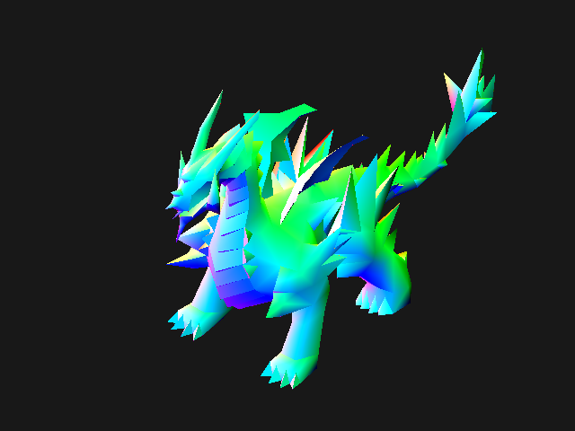

# Lesson I.9: Visualizing Normals

> **Result:** `pictures/ex09_visualize_normals.ppm`
>
> In this lesson we'll **visualize the surface normals** of the dragon model.
> Instead of sampling a texture, we map each vertex normal — a 3D direction
> vector — to an RGB color. This produces a vivid "normal map" view of the
> model that reveals the orientation of every surface, building intuition for
> for the lighting calculations in the next lesson.



---

## What We Are Doing

In the previous lesson we rendered a textured 3D dragon using a vertex/pixel
shader pipeline. The vertex data included a **normal** vector for each vertex,
but the unlit shader ignored it — it only used positions and texture
coordinates.

Normals are essential for **lighting**. A normal is a unit vector that points
perpendicular to the surface, telling us which direction the surface faces.
When light hits a surface, the angle between the light direction and the
normal determines how bright the surface appears.

Before diving into lighting, this lesson visualizes normals directly: we
interpolate them across each triangle (just like positions and UVs) and map
the `(x, y, z)` components to `(r, g, b)` color channels. The result is a
color-coded view of the model where the color at each pixel tells you the
surface orientation.

---

## What Are Normals?

A **normal** is a direction vector perpendicular to a surface. For a flat
triangle, the normal is the same everywhere — it points straight out of the
triangle's face. For a curved mesh (like our dragon), each vertex has its own
normal, and we interpolate across the triangle to approximate the curvature:

```
     ^  ^  ^
      \ | /
       \|/
   ----+----  surface
       /|\
      / | \
     v  v  v

Vertex normals approximate a curved surface
```

Normals are typically **unit vectors** (length 1.0) and their components
range from `-1.0` to `+1.0`:

| Normal direction | x     | y     | z     |
|------------------|-------|-------|-------|
| Right            | +1    | 0     | 0     |
| Left             | −1    | 0     | 0     |
| Up               | 0     | +1    | 0     |
| Down             | 0     | −1    | 0     |
| Forward (−Z)     | 0     | 0     | −1    |
| Back (+Z)        | 0     | 0     | +1    |

The OBJ file stores normals per vertex (the `vn` lines). Our `ObjModel`
loader reads them as `glam::Vec4` with `w = 0.0` (direction vectors, not
positions — so translation doesn't affect them).

---

## Mapping Normals to Colors

Since normal components are in `[-1, 1]` and color channels are in `[0, 255]`,
we need to remap:

```
color_channel = (normal_component + 1.0) / 2.0 * 255.0
```

This maps:
- `−1.0` → `0` (no color)
- `0.0` → `128` (mid-gray)
- `+1.0` → `255` (full color)

The result is a standard **normal map** color scheme:

| Surface direction | Normal      | Color              |
|-------------------|-------------|--------------------|
| Facing right (+X) | (+1, 0, 0)  | Red                |
| Facing left (−X)  | (−1, 0, 0)  | Dark cyan          |
| Facing up (+Y)    | (0, +1, 0)  | Green              |
| Facing down (−Y)  | (0, −1, 0)  | Dark magenta       |
| Facing forward    | (0, 0, −1)  | Dark blue          |
| Facing back       | (0, 0, +1)  | Light blue         |
| Facing camera     | (0, 0, −1)  | Blue-ish           |

This is the same encoding used in **tangent-space normal maps** in game
engines, where blue (`+Z` in tangent space) means "facing outward."

---

## The Normals Shader

The `DrawNormalsShader` in `src/software_buffer/ex09_visualize_normals.rs`
reuses the vertex/pixel shader traits from lesson 8 but changes both stages:

```rust
pub struct DrawNormalsShader {
    pub model_matrix: glam::Mat4,
    pub view_matrix: glam::Mat4,
    pub proj_matrix: glam::Mat4,
}
```

Notice that this shader stores the three matrices **separately** (not
pre-combined into a single MVP). This is because the normal needs a different
transform than the position.

### The vertex shader

```rust
impl VertexShader for DrawNormalsShader {
    type Output = VertexShaderData;
    fn transform_vertices(&self, input: VertexShaderData) -> VertexShaderData {
        let position = (self.proj_matrix * self.view_matrix * self.model_matrix) * input.position;
        let normal = self.model_matrix * input.normal;
        VertexShaderData { position, normal, ..input }
    }
}
```

Two transformations happen:

1. **Position** — transformed by the full MVP matrix (`projection × view ×
   model`), exactly as in lesson 8. This puts the vertex in clip space for
   rasterization.

2. **Normal** — transformed by the **model matrix only**. Why not the full
   MVP? Because normals live in **world space** for lighting purposes — we
   want to know which direction the surface faces in the world, not in clip
   space. The view and projection matrices would distort the normal's
   direction.

> **Why `model_matrix` and not `model_view_matrix`?** In this lesson we
> visualize normals in **world space** — the model's own orientation, before
> the camera transforms anything. This shows the "true" surface directions of
> the dragon as it sits in the world. In a lighting shader we might transform
> normals into view space instead, depending on where we perform the lighting
> calculation.

> **A subtlety: non-uniform scaling.** When the model matrix contains
> non-uniform scaling (different scale factors for X, Y, Z), multiplying the
> normal by the model matrix produces **incorrect** directions. The proper
> fix is to use the **inverse transpose** of the model matrix
> (`model_matrix.inverse().transpose()`). Our dragon uses uniform scaling
> (`2.0, 2.0, 2.0`), so the simple multiplication is fine here. We'll address
> this properly in later lessons.

### The pixel shader

```rust
impl PixelShader for DrawNormalsShader {
    type Input = VertexShaderData;
    fn draw_pixel(
        &self,
        software_buffer: &mut SoftwareBuffer,
        depth_texture: &mut [f32],
        vertex_input: VertexShaderData,
        fragment_x: u16,
        fragment_y: u16
    ) {
        let fragment_index = (fragment_y as usize) * software_buffer.get_width() as usize
            + (fragment_x as usize);
        if depth_texture[fragment_index] > vertex_input.position.z { return; }
        depth_texture[fragment_index] = vertex_input.position.z;

        let r = ((vertex_input.normal.x + 1.0) / 2.0 * 255.0).round().clamp(0.0, 255.0) as u8;
        let g = ((vertex_input.normal.y + 1.0) / 2.0 * 255.0).round().clamp(0.0, 255.0) as u8;
        let b = ((vertex_input.normal.z + 1.0) / 2.0 * 255.0).round().clamp(0.0, 255.0) as u8;

        let color = Color24 { r, g, b };

        software_buffer.set_pixel(fragment_x, fragment_y, color);
    }
}
```

The depth test is identical to lesson 8. The difference is in the color
computation: instead of sampling a texture, we map the interpolated normal's
`(x, y, z)` components to `(r, g, b)`.

The normal arrives interpolated by barycentric coordinates — the pipeline's
`interpolate_by_barycentric` blends the three vertex normals across the
triangle, producing a smoothly varying direction at each pixel. This is the
same mechanism that Gouraud shading (lesson 10) will use for lighting.

---

## Normal Interpolation

The `VertexShaderData` struct carries the normal alongside the position and
UV. The `InterpolatedByBarycentric` implementation (from lesson 8)
interpolates all three fields:

```rust
fn interpolate_by_barycentric(vertices: [Self; 3], barycentric_coords: [f32; 3]) -> Self {
    barycentric_coords.iter().copied()
        .zip(vertices.iter().copied()).fold(
            VertexShaderData {
                position: glam::Vec4::ZERO,
                tex_coord: glam::Vec2::ZERO,
                normal: glam::Vec4::ZERO,
            },
            |acc, (mul, next)| VertexShaderData {
                position: acc.position + mul * next.position,
                tex_coord: acc.tex_coord + mul * next.tex_coord,
                normal: acc.normal + mul * next.normal,
            }
        )
}
```

The interpolated normal is:

```
n = α·n0 + β·n1 + γ·n2
```

where `n0`, `n1`, `n2` are the three vertex normals and `(α, β, γ)` are the
barycentric weights.

> **Interpolated normals are not unit vectors.** When we blend three unit
> vectors, the result is generally **not** unit length. For visualization this
> doesn't matter much — the colors are slightly less saturated — but for
> lighting calculations the normal must be **renormalized** (divided by its
> length) at each pixel. We'll handle this in the lighting lessons.

---

## Example Walkthrough

The example — `examples/ex09_visualize_normals.rs` — is nearly identical to
lesson 8, but uses `DrawNormalsShader` instead of `DrawUnlitObjModelShader`:

```rust
use mev_graphics_tutorial::{
    software_buffer::{
        SoftwareBuffer,
        Color24,
        ex09_visualize_normals::DrawNormalsShader
    },
    obj_loader::ObjModel,
};

const DRAGON_TEXTURE_BYTES: &[u8] = include_bytes!("../assets/dragon.png");
const DRAGON_MODEL_TEXT: &str = include_str!("../assets/dragon.obj");

pub fn main() {
    let mut buffer = SoftwareBuffer::new(640, 480);
    buffer.clear(Color24 { r: 0x18, g: 0x18, b: 0x18 });
    let mut depth_texture = vec![
        0.0;
        buffer.get_width() as usize * buffer.get_height() as usize
    ];

    let image = image::load_from_memory(DRAGON_TEXTURE_BYTES)
        .expect("Failed to load image");
    let image = image.to_rgb8();

    let mut texture = vec![
        Color24 { r: 0, g: 0, b: 0 };
        image.width() as usize * image.height() as usize
    ];
    for (i, pixel) in image.pixels().enumerate() {
        texture[i] = Color24 {
            r: pixel[0],
            g: pixel[1],
            b: pixel[2]
        }
    }

    let dragon_model = ObjModel::load_from_string(DRAGON_MODEL_TEXT).unwrap();

    let model_matrix = glam::Mat4::from_translation(glam::Vec3::new(0.0, 0.0, 0.0))
        * glam::Mat4::from_scale(glam::Vec3::new(2.0, 2.0, 2.0));

    let view_matrix = glam::camera::rh::view::look_at_mat4(
        glam::Vec3::new(450.0, -500.0, -500.0),
        glam::Vec3::new(0.0, 0.0, 0.0),
        glam::Vec3::new(0.0, 1.0, 0.0)
    );

    let proj_matrix = glam::camera::rh::proj::opengl::perspective(
        std::f32::consts::FRAC_PI_2,
        buffer.get_width() as f32 / buffer.get_height() as f32,
        0.1,
        1000.0
    );

    buffer.draw_obj_model(
        &dragon_model,
        &mut depth_texture,
        &DrawNormalsShader {
            model_matrix,
            view_matrix,
            proj_matrix
        }
    );

    buffer.print_as_ppm();
}
```

### What's different from lesson 8?

1. **Shader** — `DrawNormalsShader` instead of `DrawUnlitObjModelShader`.
2. **Matrices** — passed separately (`model_matrix`, `view_matrix`,
   `proj_matrix`) instead of pre-multiplied into one MVP. The shader needs
   the model matrix alone for the normal transform.
3. **Texture** — still loaded but **unused** by the normals shader. The
   texture loading code remains for consistency with the pipeline; the
   shader simply ignores `tex_coord`.

### The camera and model setup

The camera position, model scale, and projection are identical to lesson 8.
This lets you compare the textured dragon and the normal-visualized dragon
side by side — same geometry, same viewpoint, different shading.

---

## How to Run the Example

```sh
cargo run --example ex09_visualize_normals > pictures/ex09_visualize_normals.ppm
```

Or build and run separately:

```sh
cargo build --release --example ex09_visualize_normals
./target/release/examples/ex09_visualize_normals > pictures/ex09_visualize_normals.ppm
```

Open `pictures/ex09_visualize_normals.ppm` in any image viewer. You should
see the dragon rendered in vivid colors:

- Surfaces facing **up** will be **green** (positive Y normal).
- Surfaces facing **right** will be **red** (positive X normal).
- Surfaces facing the camera (−Z) will be **dark blue**.
- Curved areas will show smooth gradients between these colors.

Compare this with the textured render from lesson 8 — the silhouette is
identical, but the surface colors now encode orientation instead of texture.

---

## Why Visualize Normals?

Normal visualization is a standard debugging tool in 3D graphics:

- **Verify model integrity** — if normals are flipped or inconsistent, the
  colors will look wrong (e.g., a surface that should be green appears dark
  magenta, meaning the normal points down instead of up).
- **Understand curvature** — smooth color gradients indicate smooth
  curvature; sharp color changes indicate hard edges where normals are not
  shared between adjacent triangles.
- **Prepare for lighting** — lighting calculations depend entirely on the
  angle between normals and light directions. Seeing the normals helps you
  predict where light and shadow will fall.

---

## Summary

In this lesson we learned about:

- **Surface normals** — unit vectors perpendicular to the surface, stored per
  vertex in the OBJ file.
- **Normal interpolation** — blending vertex normals across a triangle using
  barycentric coordinates, producing smoothly varying surface directions.
- **Normal-to-color mapping** — remapping `[-1, 1]` normal components to
  `[0, 255]` color channels for visualization.
- **Separate matrix transforms** — positions use the full MVP matrix, while
  normals use only the model matrix (to stay in world space).
- **The shader swap pattern** — reusing the same `draw_obj_model` pipeline
  with a different shader, changing only the per-vertex and per-pixel logic.

In the next lesson we'll use these normals for actual **lighting** —
implementing Gouraud shading, where light intensity is computed at each vertex
and interpolated across the triangle.

---

## Exercises

### Exercise 1: Identify the colors

Look at the rendered dragon and identify which colors appear on different
parts of the body. Why is the top of the dragon green? Why are the sides red
or dark cyan? What color would a surface facing directly toward the camera
have?

### Exercise 2: Rotate the model

Add a rotation to the model matrix (as in lesson 8, exercise 1). How do the
colors change as the dragon rotates? Surfaces that were green (facing up)
should shift to other colors as they rotate to face sideways or forward.

### Exercise 3: Flip the normals

Negate all normals in the vertex shader: `let normal = -1.0 * (self.model_matrix * input.normal);`.
How does the image change? Every color should invert — green becomes dark
magenta, red becomes dark cyan, etc. This simulates "inside-out" normals, a
common bug when models are exported with the wrong winding order.

### Exercise 4: Renormalize the interpolated normal

After barycentric interpolation, the normal is no longer unit length. Add a
renormalization step in the pixel shader before converting to color:

```rust
let normal = vertex_input.normal.normalize_or_zero();

let r = ((normal.x + 1.0) / 2.0 * 255.0).round().clamp(0.0, 255.0) as u8;
let g = ((normal.y + 1.0) / 2.0 * 255.0).round().clamp(0.0, 255.0) as u8;
let b = ((normal.z + 1.0) / 2.0 * 255.0).round().clamp(0.0, 255.0) as u8;
```

Compare the result with and without renormalization. The colors should be
slightly more saturated and consistent with renormalization. Why does this
matter for lighting?

But there's a subtlety: the model matrix in this example scales the dragon by
2× in all axes. When the normal is multiplied by `self.model_matrix` in the
vertex shader, its length **doubles** — so the normals arriving at the pixel
shader are already too long before interpolation even happens. To fix this at
the source, add a normalization in the **vertex shader** as well:

```rust
let normal = (self.model_matrix * input.normal).normalize_or_zero();
```

This ensures each vertex normal is unit length before interpolation. With both
the vertex-shader normalization and the pixel-shader renormalization in place,
the colors will be fully correct. Compare all three versions — no
normalization, vertex-only, and vertex + pixel — to see how the scaling
affects the color intensity.

### Exercise 5: View-space normals

Modify the vertex shader to transform normals by `view_matrix * model_matrix`
instead of just `model_matrix`. This puts the normals in **view space** (the
camera's coordinate system). How do the colors change? Surfaces facing the
camera should now consistently appear the same color regardless of model
rotation, because the normal is relative to the camera, not the world.

### Exercise 6: Compute face normals via cross product

The dragon model comes with **smooth vertex normals** — each vertex has its
own normal, and interpolation across triangles produces smooth color
gradients. But what if the OBJ file didn't include normals? We can compute
them ourselves.

A **face normal** is the direction perpendicular to a triangle's surface. It
can be computed from any two edges of the triangle using the **cross product**:

```rust
let p0 = obj_model.vs()[tri[0] as usize];
let p1 = obj_model.vs()[tri[1] as usize];
let p2 = obj_model.vs()[tri[2] as usize];

let edge1 = p1 - p0;
let edge2 = p2 - p0;
let face_normal = edge1.cross(edge2).normalize();
```

The cross product of two edge vectors produces a vector perpendicular to
both — which is exactly the triangle's face normal. Normalizing it ensures
unit length.

The key difference: a **face normal is the same for all three vertices** of
the triangle. When you assign this single normal to all three vertices and
interpolate, the result is **constant** across the entire triangle — no
gradient. Each triangle becomes a flat patch of solid color.

Modify the model loading step to **replace** the
loaded vertex normals with per-triangle face normals computed via cross
product. The dragon will take on a **faceted, angular look** — you'll see
individual triangles as flat-colored shards instead of smooth gradients.
This is the visual difference between **flat shading** (one normal per face)
and **smooth shading** (interpolated per-vertex normals).

> **Winding order matters.** The direction of the cross product depends on
> the order of the vertices: `edge1 × edge2` points in the opposite direction
> from `edge2 × edge1`. If the computed normals point inward (the colors look
> inverted), swap the order of the edges or negate the result. The correct
> order is determined by the triangle's **winding order** in the OBJ file —
> the same concept introduced in lesson 8's back face culling exercise.