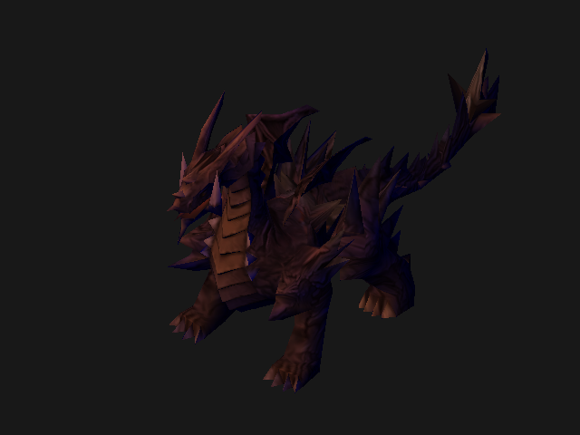

# Lesson I.10: Gouraud Shading

> **Result:** `pictures/ex0A_gouraud_shading.ppm`
>
> In this lesson we bring the dragon to life with **lighting**. We implement
> **Gouraud shading** — diffuse lighting computed per vertex and interpolated
> across the triangle — combined with our existing texture. The dragon will
> appear three-dimensional with illuminated highlights and dark shadows,
> revealing its surface curvature in a natural way.



---

## What We Are Doing

So far we've rendered the dragon with:
- **Unlit texturing** (lesson 8) — the texture is displayed as-is, flat and
  unrealistic, with no sense of depth or curvature.
- **Normal visualization** (lesson 9) — we saw the surface orientations in
  color, but the final image wasn't a "realistic" render.

Now we combine both: we compute **diffuse lighting** using the angle between
the surface normal and a light direction, producing bright illumination on
surfaces facing the light and darkness on surfaces facing away. The texture
color is multiplied by this lighting factor, giving a natural shaded look.

The technique is named **Gouraud shading** (after Henri Gouraud, who
introduced it in 1971): the lighting calculation is performed **per vertex**
in the vertex shader, and the resulting light intensity is **interpolated**
across the triangle using barycentric coordinates. This is more efficient
than computing lighting per pixel (Phong shading), at the cost of some
accuracy for small highlights.

---

## The Lighting Model: Ambient + Diffuse

Our lighting model has two components:

### Ambient light

```rust
let ambient_color = glam::vec3(0.0, 0.0, 0.4);
```

Ambient light is a constant, directionless light added to every pixel. It
represents light that has bounced around the scene so many times that it
comes from all directions equally. Without ambient light, surfaces facing
away from the light would be completely black — unnatural and harsh.

- `(0.0, 0.0, 0.4)` — a dim blue ambient, which will tint shadowed areas blue.

### Diffuse light (Lambert's cosine law)

```rust
let light_direction = glam::vec4(0.0, -1.0, -1.0, 0.0).normalize();
let light_color = glam::vec3(0.8, 0.5, 0.0);
```

Diffuse light models a directional light source (like sunlight). The
brightness of a surface depends on the cosine of the angle between the
surface normal and the direction **to** the light:

```
attenuation = max(n · l, 0)
```

where:
- `n` is the surface normal (unit vector).
- `l` is the direction **from the surface toward the light** (unit vector).
- The dot product `n · l` = `|n||l|·cos(θ)` = `cos(θ)` when both are unit length.
- `max(..., 0)` clamps negative values to 0, ensuring surfaces behind the light
  don't get "negative light."

```
       light
         ↓
         l
        ╱
       ╱ θ      surface
      ╱──────────
       ↔ n (normal)

cos(θ) = n · l
attenuation = max(n · l, 0)
```

- `θ = 0°` (surface faces the light directly) → `cos(0) = 1.0` → full brightness.
- `θ = 90°` (surface is perpendicular) → `cos(90) = 0.0` → no diffuse light.
- `θ > 90°` (surface faces away) → clamped to `0.0` → no diffuse light.

### Combined color

```rust
let color = ambient_color + light_color * attenuation;
```

The final per-vertex light intensity is the ambient base plus the directional
light multiplied by the attenuation factor. Both `ambient_color` and
`light_color` are in the `[0, 1]` range. The result is clamped to `[0, 1]`.

Our warm golden `light_color = (0.8, 0.5, 0.0)` combined with blue ambient
`(0.0, 0.0, 0.4)` produces a classic warm-light/cool-shadow contrast.

---

## The Gouraud Shader

The shader in `src/software_buffer/ex0a_gouraud_shading.rs` introduces a new
interpolated data type and a shader that implements lighting.

### A New Interpolated Type

Gouraud shading computes light at vertices, so the interpolated data carries
a **color** instead of a normal:

```rust
#[derive(Copy, Clone)]
pub struct GouraudSharedShaderData {
    pub position: glam::Vec4,
    pub tex_coord: glam::Vec2,
    pub color: glam::Vec3,  // ← pre-computed light intensity (r, g, b)
}
```

This replaces `VertexShaderData` as the `Output` / `Input` type between the
vertex and pixel shaders. The `color` field stores the RGB light intensity
computed at the vertex. The `InterpolatedByBarycentric` implementation blends
all three fields — position, UV, and color — across the triangle.

> **Why `glam::Vec3` for color?** Color values in the shader are in `[0, 1]`
> floating-point range. Using a `Vec3` lets us use vector math (addition,
> multiplication, clamping) directly, without packing/unpacking into `u8`.

### The vertex shader

```rust
impl<'a> VertexShader for DrawGouraudShadedModelShader<'a> {
    type Output = GouraudSharedShaderData;
    fn transform_vertices(&self, input: VertexShaderData) -> GouraudSharedShaderData {
        let normal = (self.model_matrix * input.normal).normalize_or_zero();
        let position = (self.proj_matrix * self.view_matrix * self.model_matrix) * input.position;
        let reversed_light_dir = -self.light_direction;
        let attenuation = normal.dot(reversed_light_dir).max(0.0);
        let color = (self.ambient_color + self.light_color * attenuation)
            .clamp(glam::Vec3::ZERO, glam::Vec3::ONE);
        GouraudSharedShaderData { position, tex_coord: input.tex_coord, color }
    }
}
```

Step by step:

1. **Transform and normalize the normal** — `self.model_matrix * input.normal`
   brings the vertex normal into world space (same as lesson 9). We then
   **normalize** the result with `.normalize_or_zero()`. The model matrix can
   change the normal's length (especially with scaling), and the dot product
   `n · l` requires a unit-length normal to produce a correct cosine value.
   Normalizing here — once per vertex — is cheaper than normalizing per pixel
   in the pixel shader.

2. **Transform the position** — the full MVP matrix converts the vertex to
   clip space (same as lesson 8).

3. **Reverse the light direction** — `let reversed_light_dir = -self.light_direction;`
   Our `light_direction` points **downward and backward** `(0, -1, -1)`. But
   the dot product formula needs the direction **from the surface toward the
   light**. Since `light_direction` points from the light toward the scene, we
   negate it: if the light comes from `(0, 1, 1)`, the direction from the
   surface to the light is `(0, 1, 1)`.

4. **Compute attenuation** — `normal.dot(reversed_light_dir)` gives the cosine
   of the angle. `max(0.0)` clamps negative values to 0.

5. **Compute the vertex color** — `ambient_color + light_color * attenuation`
   gives a per-vertex RGB intensity. The result is clamped to `[0, 1]`.

6. **Output** — the `GouraudSharedShaderData` carries the position (for
   rasterization), UV (for texturing), and the computed light color (for
   interpolation).

### The pixel shader

```rust
impl<'a> PixelShader for DrawGouraudShadedModelShader<'a> {
    type Input = GouraudSharedShaderData;

    fn draw_pixel(
        &self,
        software_buffer: &mut SoftwareBuffer,
        depth_texture: &mut [f32],
        vertex_input: GouraudSharedShaderData,
        fragment_x: u16,
        fragment_y: u16
    ) {
        // Depth test (same as before)
        let fragment_index = (fragment_y as usize) * software_buffer.get_width() as usize
            + (fragment_x as usize);
        if depth_texture[fragment_index] > vertex_input.position.z { return; }
        depth_texture[fragment_index] = vertex_input.position.z;

        // Bilinear texture sampling (same as lesson 7–8)
        let (u, v) = (vertex_input.tex_coord.x, vertex_input.tex_coord.y);
        let v = 1.0 - v;

        let texture_x = u * (self.texture_width - 1) as f32;
        let texture_y = v * (self.texture_height - 1) as f32;

        let u_frac = texture_x.fract();
        let v_frac = texture_y.fract();

        let x0 = (texture_x.trunc() as u16).clamp(0, self.texture_width - 1);
        let y0 = (texture_y.trunc() as u16).clamp(0, self.texture_height - 1);
        let x1 = (x0 + 1).clamp(0, self.texture_width - 1);
        let y1 = (y0 + 1).clamp(0, self.texture_height - 1);

        let id0 = y0 as usize * self.texture_width as usize + x0 as usize;
        let id1 = y0 as usize * self.texture_width as usize + x1 as usize;
        let id2 = y1 as usize * self.texture_width as usize + x0 as usize;
        let id3 = y1 as usize * self.texture_width as usize + x1 as usize;

        let color0 = self.texture[id0].lerp(self.texture[id1], u_frac);
        let color1 = self.texture[id2].lerp(self.texture[id3], u_frac);
        let mut tex_color = color0.lerp(color1, v_frac);

        // Multiply texture by the interpolated light color
        tex_color.r = (tex_color.r as f32 * vertex_input.color.x).clamp(0.0, 255.0) as u8;
        tex_color.g = (tex_color.g as f32 * vertex_input.color.y).clamp(0.0, 255.0) as u8;
        tex_color.b = (tex_color.b as f32 * vertex_input.color.z).clamp(0.0, 255.0) as u8;

        software_buffer.set_pixel(fragment_x, fragment_y, tex_color);
    }
}
```

The depth test and bilinear sampling are unchanged. The critical new step is
the multiplication:

```rust
tex_color.r = (tex_color.r as f32 * vertex_input.color.x).clamp(0.0, 255.0) as u8;
tex_color.g = (tex_color.g as f32 * vertex_input.color.y).clamp(0.0, 255.0) as u8;
tex_color.b = (tex_color.b as f32 * vertex_input.color.z).clamp(0.0, 255.0) as u8;
```

Each channel of the sampled texture color is **multiplied** by the
corresponding channel of the interpolated light intensity:

```
final_color = texture_color × light_color
```

This is the standard **modulate** blending used in most real-time 3D
rendering. The texture provides the surface detail; the light provides the
shading. Where the light is bright (attenuation ≈ 1.0), the texture appears
at full saturation. Where the light is dim (attenuation ≈ 0.0), the texture
is darkened — or, with ambient light alone, tinted by the ambient color.

---

## The Light and Ambient Configuration

The example sets up the lighting as follows:

```rust
&DrawGouraudShadedModelShader {
    model_matrix,
    view_matrix,
    proj_matrix,
    light_direction: glam::vec4(0.0, -1.0, -1.0, 0.0).normalize(),
    light_color: glam::vec3(0.8, 0.5, 0.0),
    ambient_color: glam::vec3(0.0, 0.0, 0.4),
    texture: &texture,
    texture_width: image.width() as u16,
    texture_height: image.height() as u16,
}
```

| Parameter        | Value              | Effect                                        |
|------------------|--------------------|-----------------------------------------------|
| `light_direction` | `(0, -1, -1)` normalized | Light comes from **behind and above** the camera — top-right-back |
| `light_color`    | `(0.8, 0.5, 0.0)`  | Warm golden light                             |
| `ambient_color`  | `(0.0, 0.0, 0.4)`  | Cool blue ambient — shadows appear blue       |

The light direction `(0, -1, -1)` points downward (−Y) and backward (−Z).
In the camera's orientation (looking from `(450, -500, -500)` toward the
origin), this puts the light source behind and above the camera, illuminating
the front and top of the dragon while leaving the underside and back in
shadow.

---

## Gouraud vs Phong Shading

The distinction between Gouraud and Phong shading is about **where** the
lighting calculation happens:

| Technique | Lighting computed | Interpolated across triangle | Visual quality |
|-----------|------------------|-----------------------------|----------------|
| **Flat** (ex. 6, lesson 9) | Once per triangle | Nothing — constant color | Faceted, angular |
| **Gouraud** | Per vertex | Light intensity | Smooth, but misses highlights inside triangles |
| **Phong** | Per pixel | Normal vector | Smooth, captures all highlights |

**Gouraud shading** computes light at each vertex and interpolates the
resulting color. It's efficient (lighting computed N times per triangle,
where N = 3 vertices), but it can miss specular highlights or sharp shadow
boundaries that fall entirely within a triangle.

**Phong shading** (named after Bui Tuong Phong) interpolates the **normal
vector** across the triangle and computes lighting per pixel. This is more
accurate but more expensive (lighting computed for every rasterized pixel).

Our implementation is classic Gouraud: the `color` field (light intensity) is
interpolated, not the normal. The difference from Phong is subtle on the
dragon model with diffuse-only lighting, but would be very visible with
specular highlights.

---

## Gouraud Shared Data: The Full Picture

```
 Vertex Shader                    Pixel Shader
 (per vertex)                     (per pixel)
                                    
 input: VertexShaderData          input: GouraudSharedShaderData
   position                         position (interpolated)
   tex_coord                        tex_coord (interpolated)
   normal → ignored                  color (interpolated)
   ↓                                ↓
 compute lighting                  sample texture
   ↓                                multiply texture × color
 output: GouraudSharedShaderData    ↓
   position                         set_pixel
   tex_coord
   color (light intensity)
```

The vertex shader transforms the raw model data into `GouraudSharedShaderData`,
which replaces the normal with a pre-computed color. The pixel shader receives
the interpolated version of this data for every pixel inside the triangle.

---

## Example Walkthrough

The example — `examples/ex0A_gouraud_shading.rs` — follows the same structure
as lessons 8–9, now using `DrawGouraudShadedModelShader`:

```rust
use mev_graphics_tutorial::{
    software_buffer::{
        SoftwareBuffer,
        Color24,
        ex0a_gouraud_shading::DrawGouraudShadedModelShader
    },
    obj_loader::ObjModel,
};

const DRAGON_TEXTURE_BYTES: &[u8] = include_bytes!("../assets/dragon.png");
const DRAGON_MODEL_TEXT: &str = include_str!("../assets/dragon.obj");

pub fn main() {
    let mut buffer = SoftwareBuffer::new(640, 480);
    buffer.clear(Color24 { r: 0x18, g: 0x18, b: 0x18 });
    let mut depth_texture = vec![
        0.0;
        buffer.get_width() as usize * buffer.get_height() as usize
    ];

    // Load texture
    let image = image::load_from_memory(DRAGON_TEXTURE_BYTES)
        .expect("Failed to load image");
    let image = image.to_rgb8();

    let mut texture = vec![
        Color24 { r: 0, g: 0, b: 0 };
        image.width() as usize * image.height() as usize
    ];
    for (i, pixel) in image.pixels().enumerate() {
        texture[i] = Color24 {
            r: pixel[0],
            g: pixel[1],
            b: pixel[2]
        }
    }

    let dragon_model = ObjModel::load_from_string(DRAGON_MODEL_TEXT).unwrap();

    let model_matrix = glam::Mat4::from_translation(glam::vec3(0.0, 0.0, 0.0))
        * glam::Mat4::from_scale(glam::vec3(2.0, 2.0, 2.0));

    let view_matrix = glam::camera::rh::view::look_at_mat4(
        glam::vec3(450.0, -500.0, -500.0),
        glam::vec3(0.0, 0.0, 0.0),
        glam::vec3(0.0, 1.0, 0.0)
    );

    let proj_matrix = glam::camera::rh::proj::opengl::perspective(
        std::f32::consts::FRAC_PI_2,
        buffer.get_width() as f32 / buffer.get_height() as f32,
        0.1,
        1000.0
    );

    buffer.draw_obj_model(
        &dragon_model,
        &mut depth_texture,
        &DrawGouraudShadedModelShader {
            model_matrix,
            view_matrix,
            proj_matrix,
            light_direction: glam::vec4(0.0, -1.0, -1.0, 0.0).normalize(),
            light_color: glam::vec3(0.8, 0.5, 0.0),
            ambient_color: glam::vec3(0.0, 0.0, 0.4),
            texture: &texture,
            texture_width: image.width() as u16,
            texture_height: image.height() as u16
        }
    );

    buffer.print_as_ppm();
}
```

The structure is identical to lesson 8's example, with the shader swapped
out — the `draw_obj_model` pipeline is completely reusable.

---

## How to Run the Example

```sh
cargo run --example ex0A_gouraud_shading > pictures/ex0A_gouraud_shading.ppm
```

Or build and run separately:

```sh
cargo build --release --example ex0A_gouraud_shading
./target/release/examples/ex0A_gouraud_shading > pictures/ex0A_gouraud_shading.ppm
```

Open `pictures/ex0A_gouraud_shading.ppm` in any image viewer. You should see
the dragon illuminated with warm golden light from above and behind. Parts of
the body facing the light will be bright and fully textured; parts in shadow
will be dark with a blue tint from the ambient light.

Compare this image with the unlit version from lesson 8 — the difference is
striking. The dragon now appears three-dimensional, with clear highlights and
shadows that reveal its surface curvature.

---

## Summary

In this lesson we learned about:

- **Gouraud shading** — computing diffuse lighting per vertex and
  interpolating the resulting color across the triangle.
- **Lambert's cosine law** — `attenuation = max(n · l, 0)`, where the dot
  product of the surface normal and the light direction determines brightness.
- **Ambient + diffuse lighting** — combining a constant ambient term with
  directional diffuse light to avoid completely black shadows.
- **`GouraudSharedShaderData`** — a new interpolated type carrying a
  pre-computed per-vertex RGB light intensity instead of the raw normal.
- **Modulate texture blending** — multiplying the sampled texture color by
  the interpolated light intensity for the final pixel.
- **Gouraud vs Phong shading** — the difference between interpolating light
  intensity (Gouraud) and interpolating normals (Phong), and the trade-off
  between efficiency and accuracy.

In the next section we'll move beyond software rendering and introduce the
**MEV** graphics API for hardware-accelerated rendering.

---

## Exercises

### Exercise 1: Change the light direction

Modify `light_direction` to illuminate the dragon from different angles. Try:
- `(0.0, 1.0, 0.0)` — light from directly below (creates an eerie look).
- `(1.0, 0.0, 0.0)` — light from the right.
- `(0.0, 0.0, 1.0)` — light from behind the dragon (most of it will be dark).

How do the shadows shift? Which features of the dragon are emphasized by each
direction?

### Exercise 2: Adjust the ambient and light colors

Change `ambient_color` and `light_color` to create different moods:
- Warm sunset: `ambient = (0.1, 0.05, 0.0)`, `light = (1.0, 0.6, 0.2)`.
- Cold moonlight: `ambient = (0.05, 0.05, 0.15)`, `light = (0.4, 0.5, 0.8)`.
- Alien world: any combination you like!

### Exercise 3: Remove the texture

Temporarily disable the texture sampling in the pixel shader, and instead use
a solid white texture or simply use `vertex_input.color` directly as the
pixel color. This shows the pure Gouraud shading without surface detail — a
smoothly shaded dragon with no texture.

### Exercise 4: Add a second light

Extend the shader to support two directional lights. Sum their contributions:

```rust
let attenuation_1 = normal.dot(reversed_light_dir_1).max(0.0);
let attenuation_2 = normal.dot(reversed_light_dir_2).max(0.0);
let color = ambient_color
    + light_color_1 * attenuation_1
    + light_color_2 * attenuation_2;
```

Use different colors (e.g., warm and cool) for the two lights. This is the
basis of **three-point lighting** used in film and photography.